### A modern, interactive chat application built with Python that leverages the power of local AI models through Ollama. This application provides a sleek web interface for chatting with various AI models in real-time.

## ✨ Features

- Multiple Model Support: Chat with various Ollama models (Llama2, Mistral, Gemma, etc.)
- Real-time Interface: Streamlit-powered responsive web UI
- Chat History: Persistent conversation during session
- Custom Styling: Modern, transparent gray text design
- Easy Model Switching: Dropdown selector for different AI models
- Session Management: Clear chat history with a single click

## 🚀 Quick Start Prerequisites
- Python 3.8+
- Ollama installed on your system

# Installation
1. Install Ollama
`curl -fsSL https://ollama.ai/install.sh | sh`
On windows
`https://ollama.com/`

2. Clone the repository:

`git clone https://github.com/Vol-Del/ai_chat.git`
`cd ai-chat`

# Install Python dependencies:

`pip install -r requirements.txt`

Download AI models (optional):

#Usage
1. Start the Ollama service:
`ollama serve`

2. Run the application:
`streamlit run chat_app.py`

Open your browser and navigate to `http://localhost:8501`

Select a model from the sidebar and start chatting!

# 🛠️ Technical Architecture

```mermaid
graph TB
    subgraph "Frontend Layer"
        A[🌐 User Interface<br>Streamlit Web App<br><i>Real-time chat interface</i>]
    end
    
    subgraph "Application Layer"
        B[🔄 Chat Handler<br>OllamaChatApp Class<br><i>Session & message management</i>]
    end
    
    subgraph "Integration Layer"
        C[🔌 AI Integration<br>Ollama Python Client<br><i>API communication</i>]
    end
    
    subgraph "Model Layer"
        D[🤖 Local AI Models<br>Llama2 • Mistral • Gemma<br><i>On-device inference</i>]
    end
    
    A -->|Sends user messages| B
    B -->|Processes requests| C
    C -->|Calls local models| D
    D -->|Returns responses| C
    C -->|Passes to handler| B
    B -->|Updates interface| A
    
    style A fill:#e6f7ff,stroke:#1890ff,stroke-width:3px,color:#000
    style B fill:#f0f2f6,stroke:#4e79a7,stroke-width:3px,color:#000
    style C fill:#f0f2f6,stroke:#4e79a7,stroke-width:3px,color:#000
    style D fill:#e6f7ff,stroke:#1890ff,stroke-width:3px,color:#000
    
    classDef frontend fill:#e6f7ff,stroke:#1890ff,stroke-width:2px
    classDef backend fill:#f0f2f6,stroke:#4e79a7,stroke-width:2px
    class A,D frontend
    class B,C backend
```

Email: vladimirartemenko@hotmail.com

[LinkedIn](https://www.linkedin.com/in/vladimirart/)

Note: This application requires Ollama to be installed and running on your system. Make sure to pull at least one model (like llama3 or DeepSeek) before using the app.

Made with ❤️ using Python, Streamlit, and Ollama
